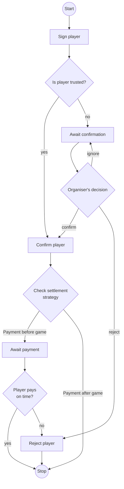

# Player approval process

The process of player approval depends on trustworthiness of player and settlement strategy.
Player that was marked as trusted to organiser will be automatically approved.
Others will require manual approval from the organiser.

## Comparison of features for settlement strategies.

| Feature      | Automatic              | Manual                           |
|--------------|------------------------|----------------------------------|
| Is premium   | yes                    | no                               |
| Debt allowed | no                     | yes                              |
| Real money   | yes (bank transaction) | no (coins assigned by organiser) |
