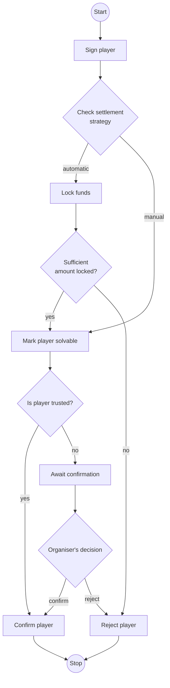

# Player confirmation process

The process of player confirmation depends on settlement strategy and trustworthiness and solvency of a player.
If the strategy is automatic the worst case amount is locked on player account until game is completed, otherwise
nothing is locked.
No matter of the strategy the actual payment happens once the game is finished.
Automatic strategy is there only to guarantee that player has sufficient amount of money to cover his fee and to
guarantee that money will be transferred once the game is finished.
This strategy secures organisers interests, but may also discourage potential players.
Player that was marked as trusted to organiser will be automatically approved.
Others will require manual approval from the organiser.

## Comparison of features for settlement strategies.

| Feature      | Automatic              | Manual                             |
|--------------|------------------------|------------------------------------|
| Is premium   | yes                    | no                                 |
| Debt allowed | no                     | yes                                |
| Real money   | yes (bank transaction) | no (coins registered by organiser) |
